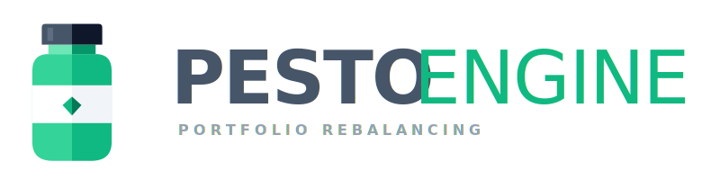

<div align="center">



**Rebalancing execution engine for passive investors**

You know your allocation. Now know exactly what to buy.

[](LICENSE)
[](https://www.python.org/)
[](https://fastapi.tiangolo.com/)

</div>

Enter your targets, current holdings, and the cash you want to deploy. PestoENGINE returns the exact number of shares to buy per asset, with your broker's fee structure already priced in, allocation drift shown, and leftover change made explicit. Same inputs always produce the same output.

No accounts. No data stored. Self-hostable. MIT licensed.

## How it works

**01 - Set your target allocation**  
Enter each ticker, your target weight, current share count, and your broker's fee. Live prices are fetched from Yahoo Finance at calculation time.

**02 - Drop in your monthly cash**  
Enter the cash you want to deploy this period. Enable buy-only mode to ensure PestoENGINE never triggers a sale. Enable knapsack mode to maximise cash deployment.

**03 - Get the exact buy order**  
PestoENGINE returns the exact number of shares to buy per asset. Deterministic, explainable, verifiable.

## Algorithm modes

| Mode | When to use |
|------|-------------|
| **Greedy** `O(n log n)` | Speed matters; some leftover tolerance is acceptable. |
| **Knapsack DP** `O(n × W)` | Cash efficiency matters; minimises leftover change. |
| **Buy-only** `O(n)` | Rebalancing without adding capital; set `only_buy: true`. |

The algorithm is not proprietary. The source is in [`app/rebalance/rebalance.py`](app/rebalance/rebalance.py). Every formula is readable and every result is verifiable by hand.

## Prerequisites

- **Docker** (recommended) — Docker Desktop or Docker Engine
- **Manual** — Python 3.11+, Node.js 20+

## Quick start

### Docker

```bash
git clone https://github.com/PestoENGINE/PestoENGINE
cd PestoENGINE
docker build -t pestoengine .
docker run -d -p 8000:8000 pestoengine
```

App at `http://localhost:8000` · Swagger UI at `http://localhost:8000/docs`

### Manual

```bash
git clone https://github.com/PestoENGINE/PestoENGINE
cd PestoENGINE && cp .env.example .env

# Backend
python -m venv venv
source venv/bin/activate
# Windows: venv\Scripts\Activate.ps1
pip install -r requirements-dev.txt
uvicorn app.main:app --reload

# Frontend (separate terminal)
cd ui && npm install
npm run dev
```

For backend details (API reference, configuration, tests) see [`app/README.md`](app/README.md).  
For frontend details (structure, build) see [`ui/README.md`](ui/README.md).

## Stack

- **Backend** - FastAPI, Python 3.11+, Yahoo Finance
- **Frontend** - Svelte 4, TypeScript, Tailwind CSS, Vite
- **Market data** - Yahoo Finance, fetched at request time, cached 5 minutes

---

*A financial tool must be auditable. So the algorithm is public.*
